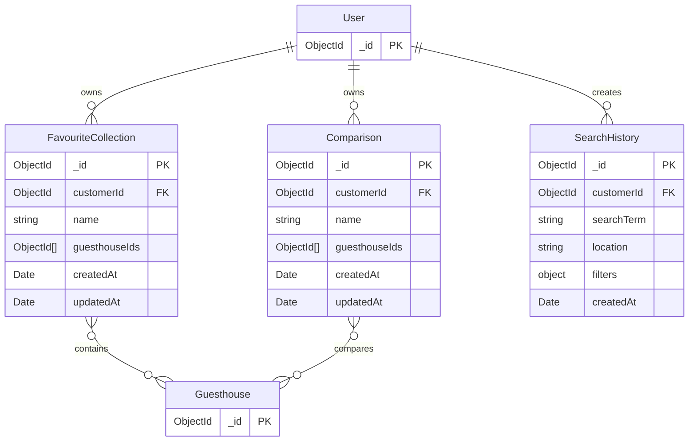

# Personalized Guesthouse Discovery — ERD

## Relationship notes

- One customer can own many favourite collections, comparisons, and search-history records.
- Each collection or comparison belongs to one customer.
- Collections and comparisons store guesthouse references in `guesthouseIds`.
- Search history belongs to a customer and stores the search term, location, filters, and creation time.
- `customerId` and `guesthouseIds` are MongoDB references. They are not SQL foreign-key constraints; ownership and guesthouse existence are validated by the application.
- Collections and comparisons may have an empty `guesthouseIds` array.
